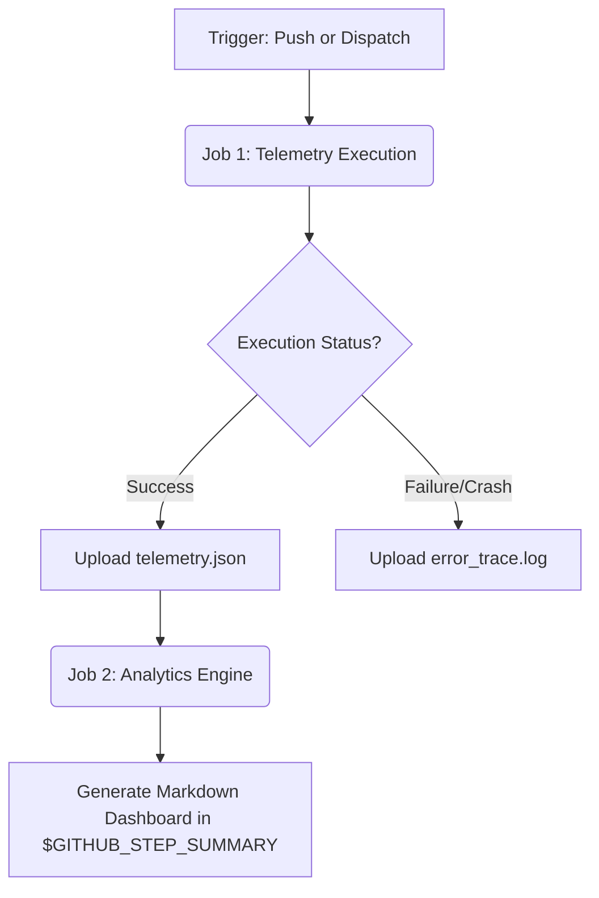

# CI Reporting Engine

An end-to-end GitHub Actions pipeline demonstrating multi-stage telemetry aggregation, inter-job artifact passing, and dynamic Markdown reporting for automated benchmarking.

## Overview
This repository serves as a proof-of-concept for a production-grade CI/CD reporting architecture. It executes parameterized test payloads, safely manages state and artifacts across isolated workflow jobs, and dynamically compiles execution telemetry into rich Markdown dashboards directly within the GitHub UI.

## Architecture Flow

## Pipeline Features

* **Parameterized Triggers:** Utilizes `workflow_dispatch` to allow manual pipeline execution with user-defined variables (`environment` and `intensity`), mimicking real-world QA and load-testing demands.
* **Conditional Artifact Handling:** Demonstrates advanced state management by capturing and uploading diagnostic stack traces exclusively when pipeline failures occur (`if: failure()`).
* **Inter-Job Data Passing:** Bypasses standard parallel execution using `needs` to strictly sequence jobs, allowing the Analytics job to download and process the JSON state generated by the Execution job.
* **Dynamic GitHub Step Summaries:** Replaces standard console logs with a custom-generated Markdown dashboard injected into `$GITHUB_STEP_SUMMARY`, providing immediate, readable metric tables for average FPS and 1% lows.

## Technical Stack & Highlights

* **Python 3:** Core execution engine utilizing `argparse` for robust CLI parameterization and native `json` handling.
* **GitHub Actions:** Multi-job orchestration, workflow triggers, and artifact management (`actions/upload-artifact@v4`, `actions/download-artifact@v4`).
* **OS-Level Buffer Management:** Implements `os.fsync()` to guarantee disk writes before container termination.